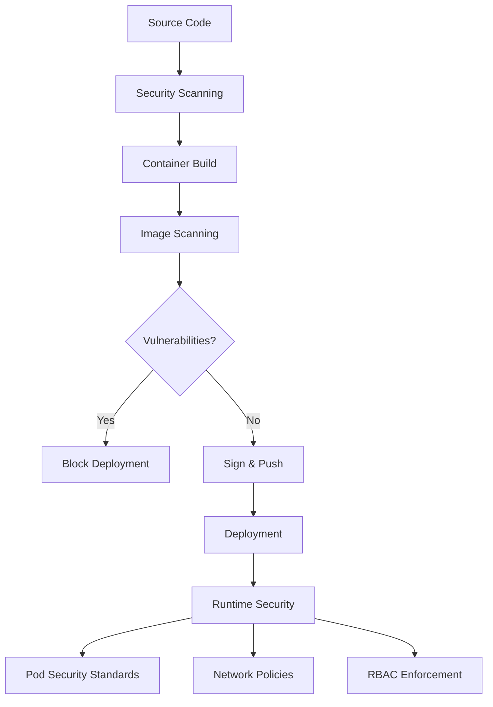
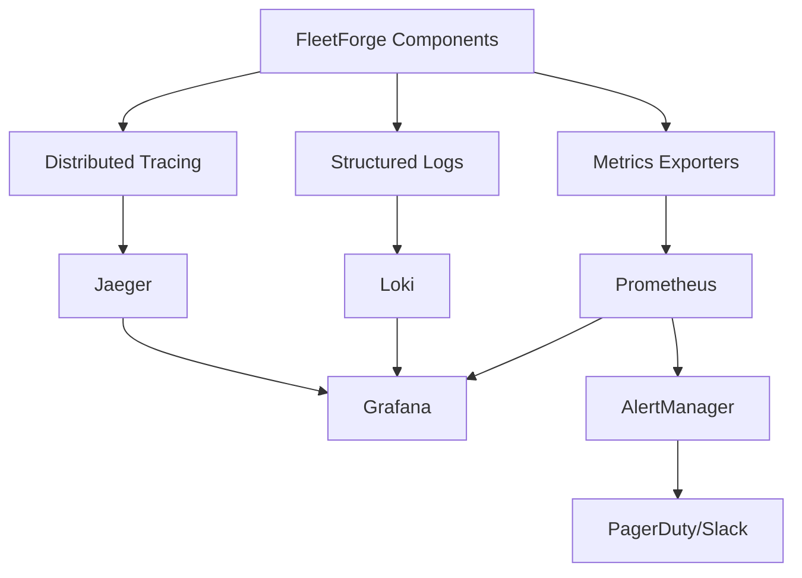
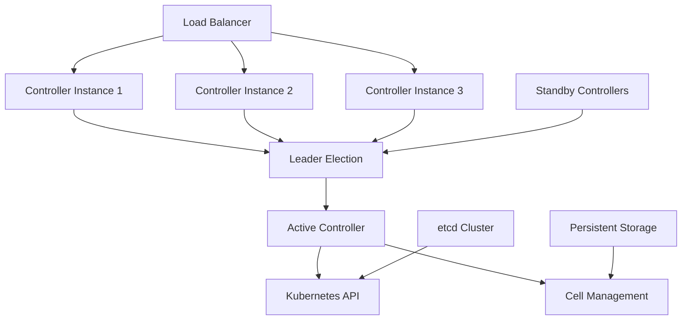
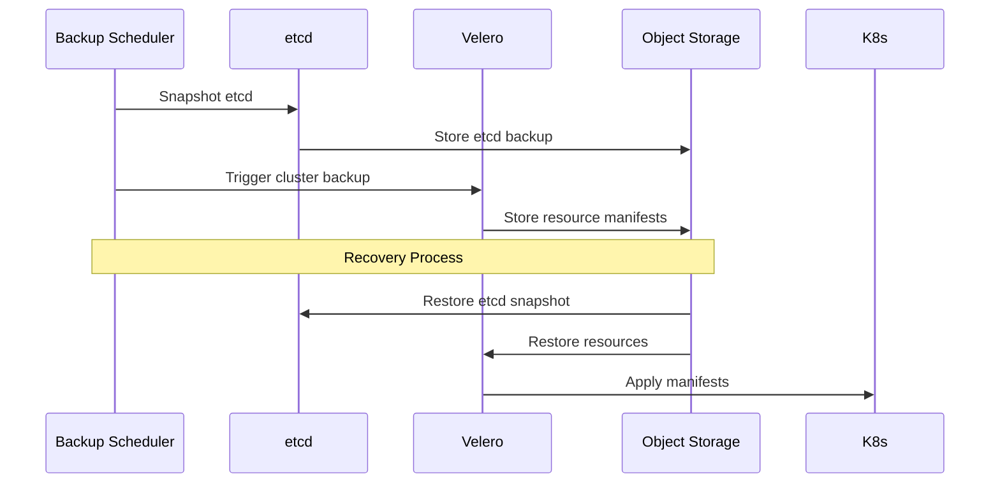
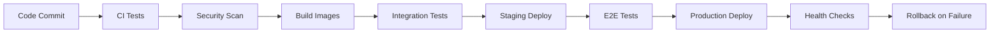
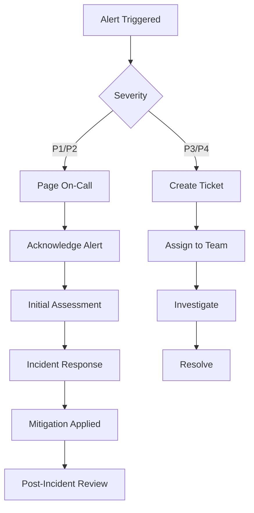

# Production Readiness Technical Design

## Document Information

- **Project**: FleetForge Production Readiness - Technical Design
- **Version**: 1.0
- **Date**: September 25, 2025
- **Status**: Draft - Technical Review
- **Related**: production-readiness-plan.md, design.md

## Architecture Overview

This document details the technical implementation strategy for transitioning FleetForge to production-ready status. The design focuses on security hardening, observability infrastructure, reliability engineering, and operational excellence.

## Technical Implementation Strategy

### Security Architecture

#### Container Security



**Implementation Details**:

- **Base Images**: Use distroless or minimal base images
- **Multi-stage Builds**: Reduce attack surface by excluding build tools
- **Vulnerability Scanning**: Integrate Trivy or Grype in CI/CD
- **Image Signing**: Use cosign for container image signing
- **Runtime Security**: Implement OPA Gatekeeper policies

#### Network Security

```yaml
# Example Network Policy
apiVersion: networking.k8s.io/v1
kind: NetworkPolicy
metadata:
  name: fleetforge-controller-policy
spec:
  podSelector:
    matchLabels:
      app: fleetforge-controller
  policyTypes:
  - Ingress
  - Egress
  ingress:
  - from:
    - namespaceSelector:
        matchLabels:
          name: monitoring
    ports:
    - protocol: TCP
      port: 8080  # Metrics
  egress:
  - to:
    - namespaceSelector:
        matchLabels:
          name: kube-system
    ports:
    - protocol: TCP
      port: 443   # Kubernetes API
```

### Observability Infrastructure

#### Monitoring Stack Architecture



**Key Components**:

1. **Prometheus Stack**
   - Prometheus Server with HA configuration
   - AlertManager with routing and silencing
   - Node Exporter for infrastructure metrics
   - Blackbox Exporter for endpoint monitoring

2. **Logging Infrastructure**
   - Loki for log aggregation
   - Promtail for log collection
   - Structured JSON logging in all components

3. **Distributed Tracing**
   - Jaeger for request tracing
   - OpenTelemetry instrumentation
   - Trace correlation with logs

#### Service Level Indicators (SLIs)

| SLI | Target | Alert Threshold | Measurement |
|-----|--------|----------------|-------------|
| WorldSpec Reconciliation Success Rate | >99.9% | <99.5% | Successful reconciliations / Total attempts |
| Reconciliation Latency | <5s (95th %ile) | >10s (95th %ile) | Time from WorldSpec change to reconciliation |
| Cell Creation Time | <30s (95th %ile) | >60s (95th %ile) | Time from reconciliation to cell ready |
| Controller Availability | >99.9% | <99.5% | Controller uptime / Total time |
| API Request Success Rate | >99.95% | <99.9% | 2xx responses / Total requests |

### Reliability Engineering

#### High Availability Design



**Implementation Strategy**:

- **Leader Election**: Use Kubernetes lease-based leader election
- **Horizontal Scaling**: Deploy 3+ controller replicas across zones
- **Graceful Shutdown**: Implement proper signal handling and cleanup
- **Circuit Breakers**: Add circuit breaker pattern for external dependencies

#### Backup and Recovery



### Performance Optimization

#### Resource Management

```yaml
# Controller Resource Configuration
resources:
  requests:
    memory: "256Mi"
    cpu: "100m"
  limits:
    memory: "512Mi"
    cpu: "500m"
    
# Horizontal Pod Autoscaler
apiVersion: autoscaling/v2
kind: HorizontalPodAutoscaler
spec:
  scaleTargetRef:
    apiVersion: apps/v1
    kind: Deployment
    name: fleetforge-controller
  minReplicas: 3
  maxReplicas: 10
  metrics:
  - type: Resource
    resource:
      name: cpu
      target:
        type: Utilization
        averageUtilization: 70
  - type: Resource
    resource:
      name: memory
      target:
        type: Utilization
        averageUtilization: 80
```

#### Caching Strategy

- **Controller Cache**: Optimize informer cache for frequently accessed resources
- **Rate Limiting**: Implement exponential backoff for reconciliation retries
- **Batch Processing**: Group similar operations to reduce API server load

### Operational Procedures

#### Deployment Pipeline



#### Incident Response



## Implementation Phases

### Phase 1: Security Hardening (Weeks 1-2)

**Week 1: Container and Image Security**

- Day 1-2: Implement vulnerability scanning in CI/CD
- Day 3-4: Migrate to distroless base images
- Day 5: Add container image signing with cosign

**Week 2: Runtime Security**

- Day 1-2: Implement Pod Security Standards
- Day 3-4: Deploy Network Policies
- Day 5: RBAC review and hardening

### Phase 2: Observability Infrastructure (Weeks 3-4)

**Week 3: Monitoring Setup**

- Day 1-2: Deploy Prometheus stack with HA configuration
- Day 3-4: Implement custom metrics in FleetForge components
- Day 5: Create initial Grafana dashboards

**Week 4: Alerting and Logging**

- Day 1-2: Configure AlertManager with routing rules
- Day 3-4: Deploy Loki stack for log aggregation
- Day 5: Implement distributed tracing with Jaeger

### Phase 3: Reliability Engineering (Weeks 5-6)

**Week 5: High Availability**

- Day 1-2: Configure leader election for controller
- Day 3-4: Deploy multi-replica controller setup
- Day 5: Test failover scenarios

**Week 6: Backup and Recovery**

- Day 1-2: Implement automated backup procedures
- Day 3-4: Create disaster recovery runbooks
- Day 5: Validate recovery procedures

### Phase 4: Operational Excellence (Weeks 7-8)

**Week 7: Automation and Procedures**

- Day 1-2: Enhance deployment automation
- Day 3-4: Create incident response procedures
- Day 5: Develop on-call runbooks

**Week 8: Validation and Training**

- Day 1-2: Conduct load testing and performance validation
- Day 3-4: Team training on new procedures
- Day 5: Final production readiness review

## Testing Strategy

### Security Testing

- **Static Analysis**: SonarQube integration for code quality
- **Dependency Scanning**: GitHub Dependabot or Snyk
- **Container Scanning**: Trivy in CI/CD pipeline
- **Penetration Testing**: Third-party security assessment

### Performance Testing

- **Load Testing**: k6 scripts for API and reconciliation load
- **Chaos Testing**: Chaos Mesh for failure injection
- **Capacity Planning**: Resource usage under various loads
- **Benchmark Suite**: Automated performance regression testing

### Integration Testing

- **End-to-End Tests**: Comprehensive user scenario testing
- **Compatibility Testing**: Multiple Kubernetes versions
- **Upgrade Testing**: Zero-downtime update validation
- **Recovery Testing**: Backup and restore procedures

## Risk Mitigation

### Technical Risks

**Risk**: Performance degradation during migration
- **Mitigation**: Phased rollout with performance monitoring
- **Rollback Plan**: Automated rollback triggers on SLI breach

**Risk**: Security vulnerabilities in new dependencies
- **Mitigation**: Automated vulnerability scanning and approval process
- **Monitoring**: Continuous security monitoring post-deployment

**Risk**: Observability overhead impacting performance
- **Mitigation**: Sampling strategies and resource limits
- **Validation**: Performance testing with full observability stack

### Operational Risks

**Risk**: Team unfamiliarity with new procedures
- **Mitigation**: Comprehensive training and documentation
- **Support**: Gradual transition with expert support

**Risk**: Alerting fatigue from false positives
- **Mitigation**: Careful threshold tuning and alert routing
- **Iterative Improvement**: Regular alert review and optimization

## Quality Assurance

### Code Quality Gates

- Unit test coverage >80%
- Integration test coverage >70%
- Security scan pass
- Performance benchmark pass
- Documentation complete

### Deployment Gates

- All tests passing
- Security review approved
- Performance validation complete
- Monitoring alerts configured
- Runbooks validated

### Production Readiness Checklist

- [ ] Security hardening complete
- [ ] Monitoring and alerting operational
- [ ] High availability configured
- [ ] Backup and recovery validated
- [ ] Team training complete
- [ ] Documentation current
- [ ] Incident procedures tested
- [ ] Performance benchmarks met

---

**Review and Approval**:

- **Technical Review**: [Pending]
- **Security Review**: [Pending]
- **Operations Review**: [Pending]
- **Final Approval**: [Pending]