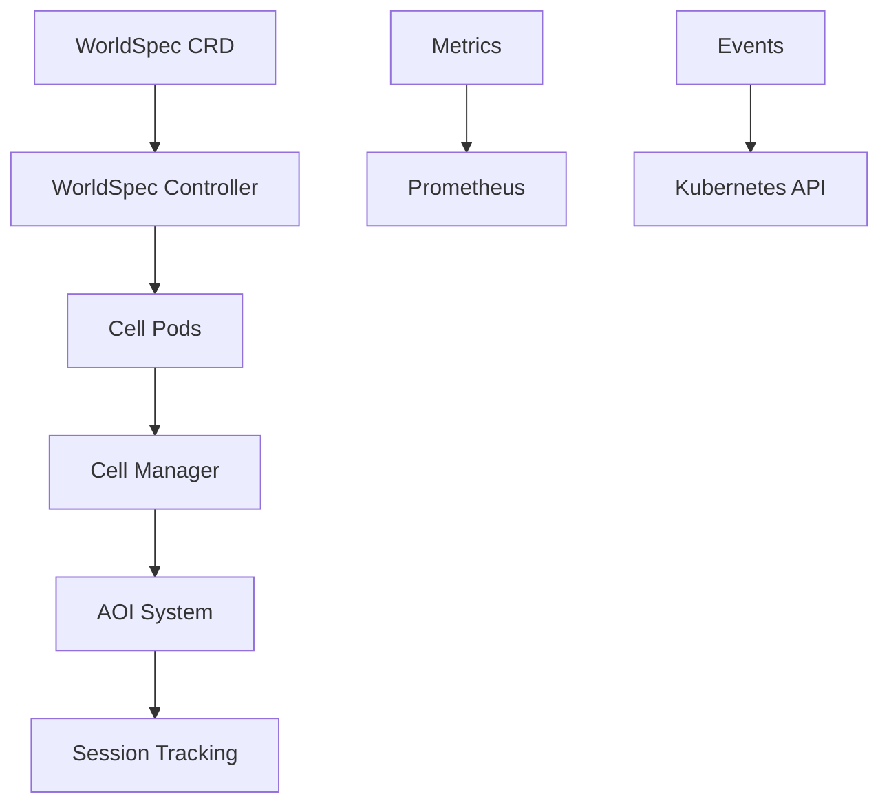

# Development Guide

Set up your development environment for contributing to FleetForge.

## Prerequisites

- Go 1.21 or later
- Docker and Docker Compose
- kubectl (for Kubernetes cluster interaction)  
- kind (for local Kubernetes development)
- make (for running build commands)

## Environment Setup

### 1. Clone and Initialize

```bash
git clone https://github.com/astrosteveo/fleetforge.git
cd fleetforge
go mod tidy
```

### 2. Create Development Cluster

```bash
make cluster-create
```

This creates a multi-node Kind cluster named `fleetforge-dev`.

### 3. Install and Deploy

```bash
# Install CRDs
make install

# Build and deploy
make build build-cell
make cluster-load
make deploy
```

## Development Workflow

### Code Organization

| Directory | Purpose |
|-----------|---------|
| `api/v1/` | API types and CRD definitions |
| `pkg/controllers/` | Kubernetes controller logic |
| `pkg/cell/` | Cell simulation engine |
| `cmd/` | Main application binaries |
| `config/` | Kubernetes manifests and samples |

### Making Changes

1. **Edit Source Code**
   - Update controller logic in `pkg/controllers/`
   - Modify cell behavior in `pkg/cell/`
   - Add new API fields in `api/v1/`

2. **Test Changes**
   ```bash
   # Run unit tests
   make test
   
   # Test specific packages
   go test ./pkg/cell/ -v
   ```

3. **Build and Deploy**
   ```bash
   make build build-cell
   make cluster-load
   make deploy
   ```

4. **Integration Testing**
   ```bash
   # Apply test WorldSpec
   kubectl apply -f config/samples/fleetforge_v1_worldspec.yaml
   
   # Watch status
   kubectl get worldspecs -w
   kubectl get pods -l app=fleetforge-cell -w
   ```

## Testing Strategy

### Unit Tests

Run comprehensive test suite:

```bash
make test
```

Test individual components:

```bash
# Controller tests
go test ./pkg/controllers/ -v

# Cell simulation tests  
go test ./pkg/cell/ -v

# API validation tests
go test ./api/v1/ -v
```

### Integration Tests

Validate end-to-end functionality:

```bash
# Create test world
kubectl apply -f config/samples/fleetforge_v1_worldspec_large.yaml

# Verify world initialization
kubectl wait --for=condition=Ready worldspec/worldspec-sample-large --timeout=60s

# Check cell pods are created
kubectl get pods -l app=fleetforge-cell

# Test cell health endpoints
kubectl port-forward <cell-pod-name> 8081:8081 &
curl http://localhost:8081/health
curl http://localhost:8081/ready  
curl http://localhost:8081/status
```

## Debugging

### Controller Issues

Check controller logs:

```bash
kubectl logs deployment/fleetforge-controller-manager -n fleetforge-system -f
```

Verify RBAC permissions:

```bash
kubectl auth can-i create worldspecs --as=system:serviceaccount:fleetforge-system:fleetforge-controller-manager
```

### Cell Issues

Debug individual cells:

```bash
# Get cell pod logs
kubectl logs <cell-pod-name> -f

# Exec into cell container
kubectl exec -it <cell-pod-name> -- /bin/sh

# Check cell metrics
kubectl port-forward <cell-pod-name> 8080:8080 &
curl http://localhost:8080/metrics
```

### Common Solutions

#### CRD Installation Issues

```bash
make uninstall
make install
kubectl get crd worldspecs.fleetforge.io
```

#### Image Pull Problems

```bash
make cluster-load
kubectl get pods -n fleetforge-system
```

#### Permission Errors

```bash
kubectl get clusterrole fleetforge-manager-role -o yaml
kubectl describe serviceaccount fleetforge-controller-manager -n fleetforge-system
```

## Code Quality

### Linting and Formatting

```bash
# Format code
make fmt

# Run linter
make vet

# Generate manifests and code
make manifests generate
```

### Pre-commit Checks

Before submitting PRs:

```bash
# Run full test suite
make test

# Build all binaries
make build build-cell

# Verify clean generation
make manifests generate
git diff --exit-code
```

## Architecture Overview

FleetForge implements the Kubernetes operator pattern:



### Key Components

- **WorldSpec Controller**: Reconciles desired vs actual state
- **Cell Manager**: Handles cell lifecycle and boundaries
- **AOI System**: Manages Areas of Interest for spatial queries
- **Session Tracking**: Tracks entities across cell boundaries

## Contributing Guidelines

### Code Style

- Follow Go conventions and idioms
- Use meaningful variable and function names
- Add comments for complex logic and public APIs
- Keep functions focused and testable

### Testing Requirements

- Unit tests for all new functionality
- Integration tests for controller behavior
- Test both success and error scenarios
- Maintain >80% test coverage

### Documentation

- Update relevant documentation for changes
- Add examples for new features
- Document breaking changes in commit messages
- Update API reference for schema changes

### Pull Request Process

1. Create feature branch from `main`
2. Implement changes with tests
3. Update documentation
4. Verify all tests pass
5. Submit PR with clear description

For detailed project information, see:

- **[Architecture Design](../architecture/design.md)**: System design details
- **[API Reference](../api-reference/index.md)**: Complete API documentation  
- **[Implementation Tasks](../product/tasks.md)**: Development roadmap