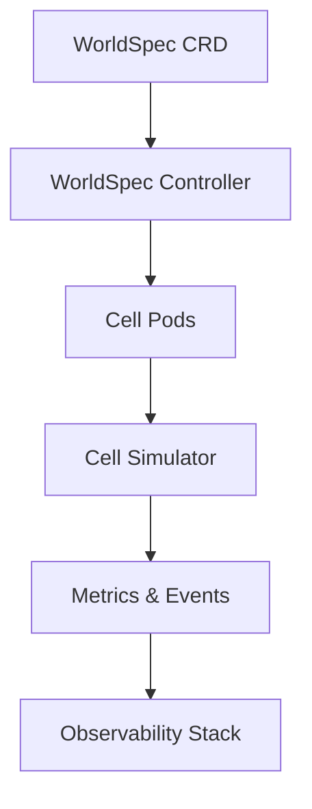

# FleetForge Documentation

FleetForge helps studios operate elastic, low-latency worlds on Kubernetes. Explore product direction, architecture, and runbooks from a single, curated hub.

::: {.hero}

## Build elastic game worlds with confidence

Deploy the FleetForge operator, partition worlds into adaptive cells, and keep player sessions stable even during demand spikes.

[Start the quick start](getting-started/quick-start.md){ .md-button .md-button--primary }
[Review the architecture](architecture/design.md){ .md-button }

:::

## Why teams choose FleetForge

::: {.grid .cards}

- :material-swap-horizontal-circle: **Elastic cell orchestration**

    Autoscale world regions in real time with guardrails on cost and latency.  
    [:octicons-arrow-right-16: Explore the controller](architecture/design.md)

- :material-map-search-outline: **Intelligent world partitioning**

    Balance player density across shards using adaptive spatial boundaries.  
    [:octicons-arrow-right-16: See WorldSpec](api-reference/index.md)

- :material-shield-check: **Production readiness baked in**

    Apply observability, security, and reliability checklists before each launch.  
    [:octicons-arrow-right-16: Follow the readiness plan](product/production-readiness-plan.md)

:::

## Choose your path

::: {.grid .cards}

- :material-hammer-wrench: **Platform engineers**

    Stand up the operator locally, integrate with CI, and ship safe upgrades.  
    [:octicons-arrow-right-16: Development guide](getting-started/development.md)

- :material-chart-line: **Live operations teams**

    Monitor elasticity, respond to incidents, and share dashboards with stakeholders.  
    [:octicons-arrow-right-16: Operations hub](ops/index.md)

- :material-lightbulb-on: **Product leaders**

    Track specification-driven delivery, roadmap, and launch approvals.  
    [:octicons-arrow-right-16: Product planning](product/prd.md)

:::

## Launch readiness snapshot

| Capability | Status | Notes |
| --- | --- | --- |
| WorldSpec CRD | ✅ Complete | Supports core boundary management and cell templates. |
| Cell lifecycle | ✅ Complete | Handles create, scale, and remove operations. |
| Elastic splitting | 🚧 In progress | Production readiness design drafted; implementation underway. |
| Multi-tenant vcluster | 🚧 In progress | Tracked in `REQ-204` and aligned to rollout plan. |
| Observability suite | 📋 Planned | Metrics, dashboards, and alerts outlined in operations runbooks. |

## Architecture at a glance

## Stay connected

- Browse the full navigation for deep dives and runbooks.
- Report issues or feature requests on [GitHub Issues](https://github.com/astrosteveo/fleetforge/issues).
- Join the conversation on [GitHub Discussions](https://github.com/astrosteveo/fleetforge/discussions).
- Contribute with confidence using the [docs site playbook](contributing/docs-site-playbook.md).