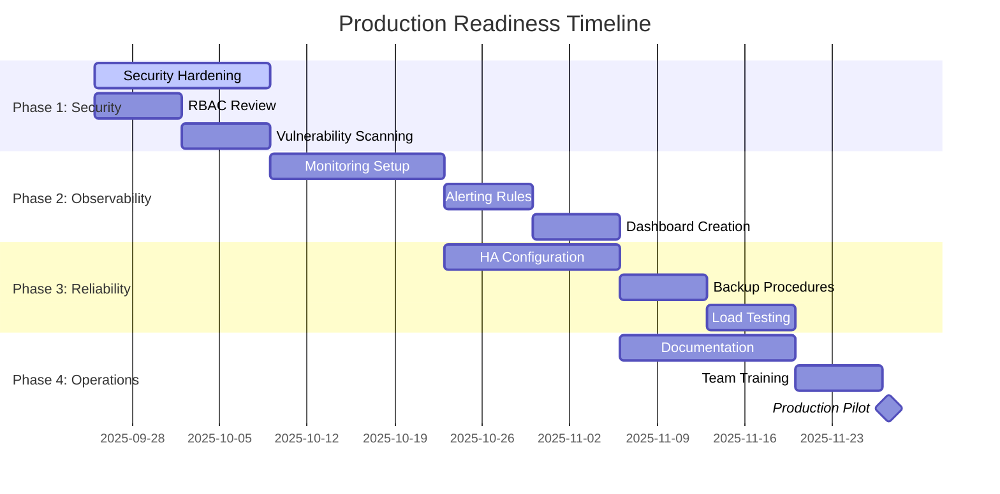

# Production Readiness Plan: FleetForge Platform

## Document Information

- **Project**: FleetForge Production Readiness Initiative
- **Version**: 1.0
- **Date**: September 25, 2025
- **Status**: Draft - Pending Team Review and Approval
- **Authors**: Development Team
- **Reviewers**: [To be assigned]
- **Approvers**: [To be assigned]

## Executive Summary

This document defines the comprehensive plan to transition FleetForge from MVP development state to production-ready platform. The plan addresses security, observability, reliability, compliance, and operational requirements necessary for enterprise deployment.

### Business Objectives

- **Risk Mitigation**: Eliminate security vulnerabilities and operational risks
- **Operational Excellence**: Enable 24/7 operations with proper monitoring and incident response
- **Compliance**: Meet enterprise security and governance standards
- **User Confidence**: Provide reliable, well-documented platform for adoption
- **Scalability**: Ensure platform can handle production workloads and growth

### Success Criteria

- ✅ Pass enterprise security audit
- ✅ Achieve 99.9% uptime SLA capability
- ✅ Complete disaster recovery validation
- ✅ Team sign-off on all production procedures
- ✅ Successful production pilot deployment

## Requirements (EARS Notation)

### Security Requirements

**REQ-SEC-001**: WHEN the FleetForge controller starts, THE SYSTEM SHALL validate all RBAC permissions are minimal and follow least-privilege principle

**REQ-SEC-002**: WHEN container images are built, THE SYSTEM SHALL scan for vulnerabilities and block deployment if critical CVEs are detected

**REQ-SEC-003**: WHEN secrets are required, THE SYSTEM SHALL use Kubernetes secrets or external secret management, never hardcoded values

**REQ-SEC-004**: WHEN network traffic occurs between components, THE SYSTEM SHALL enforce network policies that deny unauthorized communication

**REQ-SEC-005**: WHEN pods are deployed, THE SYSTEM SHALL enforce restricted pod security standards

### Observability Requirements

**REQ-OBS-001**: WHEN system components are running, THE SYSTEM SHALL expose Prometheus-compatible metrics for all critical operations

**REQ-OBS-002**: WHEN error conditions occur, THE SYSTEM SHALL emit structured logs with correlation IDs for tracing

**REQ-OBS-003**: WHEN SLI thresholds are breached, THE SYSTEM SHALL trigger alerts within 60 seconds

**REQ-OBS-004**: WHEN incidents occur, THE SYSTEM SHALL provide distributed tracing capabilities for root cause analysis

**REQ-OBS-005**: WHEN audit events happen, THE SYSTEM SHALL log all administrative actions with timestamps and actor identification

### Reliability Requirements

**REQ-REL-001**: WHEN the controller leader fails, THE SYSTEM SHALL elect a new leader within 30 seconds

**REQ-REL-002**: WHEN nodes fail, THE SYSTEM SHALL reschedule affected workloads within 2 minutes

**REQ-REL-003**: WHEN resource limits are reached, THE SYSTEM SHALL gracefully degrade rather than crash

**REQ-REL-004**: WHEN updates are deployed, THE SYSTEM SHALL support zero-downtime rolling updates

**REQ-REL-005**: WHEN data corruption occurs, THE SYSTEM SHALL restore from backup within 4 hours (RTO)

### Performance Requirements

**REQ-PERF-001**: WHEN WorldSpec is created, THE SYSTEM SHALL reconcile and create initial cells within 30 seconds

**REQ-PERF-002**: WHEN system is under load, THE SYSTEM SHALL maintain reconciliation latency under 5 seconds at 95th percentile

**REQ-PERF-003**: WHEN scaling occurs, THE SYSTEM SHALL support up to 1000 concurrent WorldSpecs per cluster

**REQ-PERF-004**: WHEN resource usage grows, THE SYSTEM SHALL use less than 500MB memory per 100 active cells

### Compliance Requirements

**REQ-COMP-001**: THE SYSTEM SHALL maintain audit logs for all CRD operations for minimum 90 days

**REQ-COMP-002**: THE SYSTEM SHALL support backup and restore procedures with documented recovery time objectives

**REQ-COMP-003**: THE SYSTEM SHALL provide role-based access control that can be integrated with enterprise identity systems

**REQ-COMP-004**: THE SYSTEM SHALL document all data flows and storage requirements for compliance review

## Production Readiness Phases

### Phase 1: Security Hardening (Weeks 1-2)
**Objective**: Eliminate security vulnerabilities and implement security best practices

**Key Deliverables**:
- Container image vulnerability scanning in CI/CD
- RBAC review and hardening
- Network policies implementation
- Secret management integration
- Pod security standards enforcement
- Security audit documentation

### Phase 2: Observability Infrastructure (Weeks 3-4)
**Objective**: Implement comprehensive monitoring, logging, and alerting

**Key Deliverables**:
- Prometheus monitoring stack deployment
- Grafana dashboards for all components
- Structured logging implementation
- Alert manager rules and escalation
- Distributed tracing setup
- SLI/SLO definitions and monitoring

### Phase 3: Reliability Engineering (Weeks 5-6)
**Objective**: Ensure high availability and disaster recovery capabilities

**Key Deliverables**:
- High availability controller configuration
- Backup and restore procedures
- Chaos engineering tests
- Load testing and capacity planning
- Disaster recovery runbooks
- Performance optimization

### Phase 4: Operational Excellence (Weeks 7-8)
**Objective**: Complete operational procedures and documentation

**Key Deliverables**:
- Production deployment automation
- Incident response procedures
- On-call runbooks and training
- Release pipeline automation
- Documentation reorganization
- Team training completion

## Risk Assessment

### High-Risk Items

**Risk**: Security vulnerabilities in production deployment
- **Impact**: High - Data breach or system compromise
- **Likelihood**: Medium
- **Mitigation**: Comprehensive security scanning and penetration testing

**Risk**: Insufficient monitoring leading to undetected failures
- **Impact**: High - Service degradation or outages
- **Likelihood**: Medium  
- **Mitigation**: Redundant monitoring and proactive alerting

**Risk**: Data loss due to inadequate backup procedures
- **Impact**: Critical - Permanent data loss
- **Likelihood**: Low
- **Mitigation**: Automated backup testing and recovery validation

### Medium-Risk Items

**Risk**: Performance degradation under production load
- **Impact**: Medium - User experience issues
- **Likelihood**: Medium
- **Mitigation**: Load testing and performance benchmarking

**Risk**: Incomplete operational procedures causing incidents
- **Impact**: Medium - Extended incident resolution
- **Likelihood**: High
- **Mitigation**: Comprehensive runbook development and team training

## Resource Requirements

### Team Allocation

- **Lead Architect**: 1 FTE - Overall coordination and technical decisions
- **Security Engineer**: 1 FTE - Security hardening and compliance
- **DevOps Engineer**: 1 FTE - Infrastructure and monitoring setup
- **Backend Engineer**: 1 FTE - Code changes and optimization
- **Technical Writer**: 0.5 FTE - Documentation and procedures

### Infrastructure Requirements

- **Staging Environment**: Production-like cluster for testing
- **Monitoring Stack**: Prometheus, Grafana, AlertManager deployment
- **CI/CD Enhancement**: Security scanning tools and automation
- **Backup Infrastructure**: Automated backup and restore capabilities

### Budget Considerations

- **Cloud Resources**: Additional compute and storage for monitoring
- **Security Tools**: Vulnerability scanning and compliance tools
- **Training**: Team training on new procedures and tools
- **External Review**: Optional third-party security audit

## Success Metrics

### Technical Metrics

- **Security**: Zero critical vulnerabilities in production images
- **Availability**: 99.9% uptime measured over 30 days
- **Performance**: 95th percentile reconciliation latency < 5 seconds
- **Recovery**: RTO < 4 hours, RPO < 1 hour for disaster scenarios

### Operational Metrics

- **Documentation**: 100% of procedures documented and tested
- **Training**: 100% of team members certified on procedures
- **Automation**: 95% of operational tasks automated
- **Compliance**: Pass all security and compliance audits

### Quality Gates

**Phase Completion Criteria**:
- All requirements implemented and tested
- Peer review completed for all deliverables
- Security review passed
- Performance benchmarks met
- Documentation complete and approved

**Production Go/No-Go Criteria**:
- All security requirements validated
- Monitoring and alerting operational
- Backup and recovery tested
- Team trained and certified
- Pilot deployment successful

## Timeline and Dependencies

## Approval Process

### Review Stages

1. **Technical Review**: Lead Architect and Senior Engineers
2. **Security Review**: Security Engineer and CISO (if applicable)
3. **Operations Review**: DevOps Engineer and Operations Manager
4. **Executive Approval**: Engineering Director and Product Owner

### Approval Criteria

- [ ] All requirements clearly defined and testable
- [ ] Timeline and resource allocation realistic and approved
- [ ] Risk mitigation strategies adequate
- [ ] Success criteria measurable and achievable
- [ ] Budget and resources allocated
- [ ] Team commitment and availability confirmed

### Sign-off Requirements

**Technical Approval**:
- [ ] Lead Architect: _________________________ Date: _______
- [ ] Senior Backend Engineer: ________________ Date: _______
- [ ] DevOps Engineer: _______________________ Date: _______

**Security Approval**:
- [ ] Security Engineer: _____________________ Date: _______
- [ ] Security Review Board: _________________ Date: _______

**Management Approval**:
- [ ] Engineering Director: __________________ Date: _______
- [ ] Product Owner: ________________________ Date: _______

### Change Management

**Document Updates**: All changes to this plan require approval from original approvers

**Scope Changes**: Major scope changes require re-approval process

**Timeline Changes**: Schedule changes > 1 week require management approval

## Next Steps

1. **Distribute for Review**: Send to all stakeholders for review
2. **Schedule Review Meetings**: Technical, security, and management reviews
3. **Incorporate Feedback**: Update document based on review comments
4. **Obtain Approvals**: Secure all required sign-offs
5. **Kick-off Implementation**: Begin Phase 1 execution upon final approval

---

**Document Control**:
- **Created**: September 25, 2025
- **Last Modified**: September 25, 2025
- **Next Review**: Upon completion of each phase
- **Distribution**: FleetForge core team, engineering leadership, security team