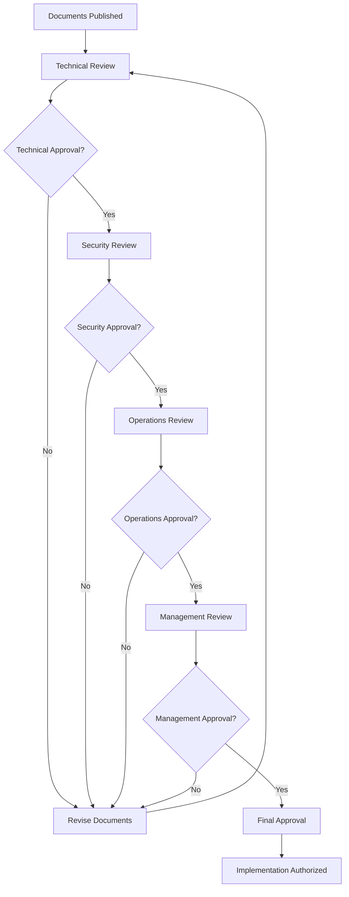

# Production Readiness Review Process

## Document Information

- **Project**: FleetForge Production Readiness - Review and Approval Process
- **Version**: 1.0
- **Date**: September 25, 2025
- **Status**: Ready for Implementation
- **Purpose**: Define formal peer review and approval workflow for production readiness initiative

## Review Framework

This document establishes the formal review process for the FleetForge Production Readiness initiative, ensuring thorough evaluation and team consensus before implementation begins.

## Review Stages

### Stage 1: Technical Review

**Objective**: Validate technical feasibility, architecture decisions, and implementation approach

**Reviewers**:

- Lead Architect (Primary)
- Senior Backend Engineer
- DevOps Engineer
- Security Engineer (for security-related sections)

**Review Criteria**:

- [ ] Technical approach is sound and follows best practices
- [ ] Architecture decisions align with system design principles
- [ ] Implementation tasks are clearly defined and achievable
- [ ] Dependencies and timelines are realistic
- [ ] Risk mitigation strategies are adequate
- [ ] Resource requirements are justified

**Review Process**:

1. **Document Distribution**: Share all three documents with technical reviewers
2. **Individual Review**: 3 business days for individual review and comment
3. **Technical Review Meeting**: 2-hour session to discuss findings and concerns
4. **Revision Period**: 2 business days to incorporate feedback
5. **Technical Sign-off**: Final approval from Lead Architect

### Stage 2: Security Review

**Objective**: Validate security requirements, threat mitigation, and compliance alignment

**Reviewers**:

- Security Engineer (Primary)
- Lead Architect
- Compliance Officer (if applicable)
- External Security Consultant (optional)

**Review Criteria**:

- [ ] Security requirements follow industry best practices
- [ ] Threat modeling covers all attack vectors
- [ ] Compliance requirements adequately addressed
- [ ] Security controls are implementable and effective
- [ ] Security testing approach is comprehensive
- [ ] Incident response procedures include security considerations

**Review Process**:

1. **Security Analysis**: Deep dive into security aspects of the plan
2. **Threat Assessment**: Validate threat model and mitigation strategies
3. **Compliance Check**: Ensure all regulatory requirements are met
4. **Security Review Meeting**: Dedicated session for security concerns
5. **Security Sign-off**: Approval from Security Engineer and leadership

### Stage 3: Operations Review

**Objective**: Validate operational feasibility, monitoring approach, and incident procedures

**Reviewers**:

- DevOps Engineer (Primary)
- Technical Writer
- Operations Manager (if applicable)
- On-call Team Representatives

**Review Criteria**:

- [ ] Monitoring and alerting strategy is comprehensive
- [ ] Incident response procedures are actionable
- [ ] Documentation is complete and accessible
- [ ] Training requirements are realistic
- [ ] Operational complexity is manageable
- [ ] Backup and recovery procedures are tested

**Review Process**:

1. **Operational Assessment**: Review monitoring, alerting, and procedures
2. **Runbook Validation**: Verify operational procedures are executable
3. **Training Evaluation**: Assess team readiness and training needs
4. **Operations Review Meeting**: Focus on operational concerns
5. **Operations Sign-off**: Approval from DevOps Engineer and operations team

### Stage 4: Management Review

**Objective**: Validate business alignment, resource allocation, and timeline feasibility

**Reviewers**:

- Engineering Director (Primary)
- Product Owner
- Project Manager (if applicable)
- Budget/Finance Representative (if applicable)

**Review Criteria**:

- [ ] Initiative aligns with business objectives and priorities
- [ ] Resource allocation is appropriate and available
- [ ] Timeline is realistic and acceptable
- [ ] Budget requirements are approved
- [ ] Risk/reward ratio is acceptable
- [ ] Success metrics are measurable and meaningful

**Review Process**:

1. **Business Case Review**: Validate business justification and ROI
2. **Resource Allocation**: Confirm team availability and budget
3. **Timeline Assessment**: Validate schedule against other priorities
4. **Management Review Meeting**: Executive decision-making session
5. **Executive Sign-off**: Final approval from Engineering Director

## Review Documentation

### Review Checklist Template

**Document**: [Production Readiness Plan | Technical Design | Implementation Tasks]  
**Reviewer**: [Name and Role]  
**Review Date**: [Date]  
**Review Stage**: [Technical | Security | Operations | Management]

#### General Assessment

- [ ] **Completeness**: All required sections are present and detailed
- [ ] **Clarity**: Requirements and procedures are clearly articulated
- [ ] **Feasibility**: Proposed approach is realistic and achievable
- [ ] **Alignment**: Aligns with project objectives and constraints

#### Specific Review Areas

**Technical Aspects** (Technical Review):

- [ ] Architecture decisions are sound
- [ ] Implementation approach is appropriate
- [ ] Dependencies are clearly identified
- [ ] Testing strategy is comprehensive

**Security Aspects** (Security Review):

- [ ] Security requirements are comprehensive
- [ ] Threat mitigation strategies are effective
- [ ] Compliance requirements are addressed
- [ ] Security testing is adequate

**Operational Aspects** (Operations Review):

- [ ] Monitoring and alerting are comprehensive
- [ ] Procedures are actionable and tested
- [ ] Documentation is complete and accessible
- [ ] Team training is adequate

**Business Aspects** (Management Review):

- [ ] Business justification is clear
- [ ] Resource requirements are reasonable
- [ ] Timeline is acceptable
- [ ] Risk mitigation is adequate

#### Comments and Concerns

**Major Issues** (Must be addressed before approval):

1. [Issue description and recommended resolution]
2. [Issue description and recommended resolution]

**Minor Issues** (Should be addressed but not blocking):

1. [Issue description and suggested improvement]
2. [Issue description and suggested improvement]

**Suggestions** (Optional improvements):

1. [Suggestion for enhancement]
2. [Suggestion for enhancement]

#### Recommendation

- [ ] **Approve**: Ready to proceed as documented
- [ ] **Approve with Minor Changes**: Approve pending resolution of minor issues
- [ ] **Request Major Revisions**: Significant changes required before approval
- [ ] **Reject**: Fundamental issues requiring complete rework

**Reviewer Signature**: _________________________ **Date**: _______

### Review Meeting Agenda Template

**Meeting**: FleetForge Production Readiness Review  
**Date**: [Date]  
**Time**: [Time and Duration]  
**Attendees**: [List of required attendees]  
**Review Stage**: [Technical | Security | Operations | Management]

#### Agenda

1. **Opening and Objectives** (10 minutes)
   - Review meeting objectives and expected outcomes
   - Confirm all reviewers have completed individual reviews

2. **Document Overview** (20 minutes)
   - Brief presentation of key aspects by document authors
   - Clarification of any ambiguous sections

3. **Major Issues Discussion** (60 minutes)
   - Review all major issues identified by reviewers
   - Discuss resolution approaches and timeline
   - Reach consensus on required changes

4. **Minor Issues and Suggestions** (30 minutes)
   - Review minor issues and improvement suggestions
   - Prioritize changes and enhancements
   - Assign responsibility for implementation

5. **Decision and Next Steps** (10 minutes)
   - Formal decision on approval status
   - Define revision timeline if changes required
   - Schedule follow-up reviews if needed

#### Pre-Meeting Requirements

- All reviewers must complete individual reviews before the meeting
- Review checklists must be submitted 24 hours before the meeting
- Document authors should prepare responses to identified issues

#### Post-Meeting Actions

- Meeting notes and decisions documented within 24 hours
- Required changes assigned and scheduled
- Follow-up meetings scheduled as needed

## Approval Workflow

### Approval Sequence

### Approval Criteria

**Technical Approval**:

- All technical reviewers have signed off
- Major technical issues resolved
- Implementation approach validated

**Security Approval**:

- Security requirements meet standards
- Compliance obligations satisfied
- Risk mitigation strategies approved

**Operations Approval**:

- Operational procedures validated
- Monitoring and alerting adequate
- Team readiness confirmed

**Management Approval**:

- Business case justified
- Resources allocated and available
- Timeline and budget approved

### Escalation Process

**Technical Disputes**:

- Escalate to Engineering Director
- External technical consultation if needed
- Architecture Review Board decision (if exists)

**Security Concerns**:

- Escalate to CISO or Security Leadership
- External security audit if required
- Compliance review if needed

**Resource Conflicts**:

- Escalate to Engineering Director
- Project prioritization review
- Executive decision on resource allocation

## Change Management

### Document Updates

**Minor Changes** (typos, clarifications):

- Can be made without re-approval
- Must be documented in change log
- Notify reviewers of changes

**Major Changes** (scope, timeline, approach):

- Require re-review by affected review stages
- May require complete re-approval cycle
- Must be justified and documented

### Scope Changes

**Scope Expansion**:

- Requires management approval
- May require complete re-review
- Resource and timeline impact assessment

**Scope Reduction**:

- Requires stakeholder notification
- May affect other project dependencies
- Success criteria may need adjustment

## Success Metrics

### Review Process Effectiveness

- **Review Completion Time**: Target 2 weeks from submission to final approval
- **Issue Identification Rate**: Measure quality of review process
- **Revision Cycles**: Target maximum 2 revision cycles
- **Reviewer Participation**: 100% completion of required reviews

### Implementation Success

- **Schedule Adherence**: Track actual vs. planned timeline
- **Quality Metrics**: Post-implementation defect rates
- **Team Satisfaction**: Team feedback on process effectiveness
- **Business Value**: Achievement of stated objectives

## Implementation Authorization

### Final Approval Requirements

Upon successful completion of all review stages:

- [ ] All review stages completed successfully
- [ ] All major issues resolved and documented
- [ ] Required revisions incorporated
- [ ] Final approval signatures obtained
- [ ] Implementation team briefed and ready
- [ ] Project tracking systems updated

### Go/No-Go Decision

**Criteria for Implementation Authorization**:

- All four review stages completed with approval
- No unresolved major issues remain
- Team resources confirmed and available
- Implementation plan validated and ready
- Success criteria defined and measurable

### Implementation Kickoff

**Upon Authorization**:

1. **Team Notification**: Inform all stakeholders of approval
2. **Resource Allocation**: Confirm and allocate required resources
3. **Project Tracking**: Set up progress monitoring and reporting
4. **Risk Monitoring**: Establish ongoing risk assessment
5. **Communication Plan**: Regular progress updates to stakeholders

---

**Process Owner**: Engineering Director  
**Process Review**: Quarterly review of process effectiveness  
**Next Review**: After completion of first production readiness initiative