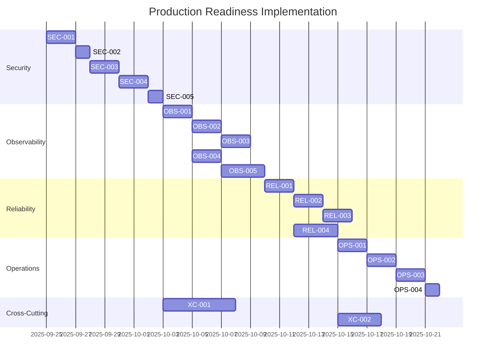

# Production Readiness Implementation Tasks

## Document Information

- **Project**: FleetForge Production Readiness - Implementation Tasks
- **Version**: 1.0
- **Date**: September 25, 2025
- **Status**: Draft - Pending Approval
- **Related**: production-readiness-plan.md, production-readiness-design.md

## Task Breakdown Structure

This document provides detailed, trackable tasks for implementing production readiness across all phases. Each task includes acceptance criteria, dependencies, and validation steps following the Spec Driven Workflow v1.

## Phase 1: Security Hardening (Weeks 1-2)

### Task SEC-001: Container Vulnerability Scanning

**ID**: SEC-001  
**Priority**: Critical  
**Estimated Effort**: 2 days  
**Assignee**: DevOps Engineer  
**Dependencies**: None  

**Description**: Implement container image vulnerability scanning in CI/CD pipeline to detect and block deployment of images with critical vulnerabilities.

**Acceptance Criteria**:

- [ ] Trivy scanner integrated into GitHub Actions workflow
- [ ] Vulnerability scanning runs on every container build
- [ ] Critical CVE detection blocks image deployment
- [ ] Vulnerability reports stored as build artifacts
- [ ] Slack notifications for critical vulnerabilities

**Implementation Steps**:

1. Add Trivy action to `.github/workflows/docker-build.yml`
2. Configure vulnerability thresholds (block on HIGH/CRITICAL)
3. Add vulnerability report artifact upload
4. Test with known vulnerable image
5. Configure notification webhooks

**Validation**: 

```bash
# Test with vulnerable image
docker build -t test-vuln --build-arg BASE_IMAGE=nginx:1.10 .
# Should fail CI with vulnerability report
```

**Deliverables**:

- Updated CI/CD workflow with vulnerability scanning
- Vulnerability threshold configuration
- Test results and documentation

### Task SEC-002: Distroless Base Images

**ID**: SEC-002  
**Priority**: High  
**Estimated Effort**: 1 day  
**Assignee**: Backend Engineer  
**Dependencies**: SEC-001  

**Description**: Migrate container images to use distroless base images to reduce attack surface and eliminate package manager vulnerabilities.

**Acceptance Criteria**:

- [ ] Controller image uses distroless Go base
- [ ] Cell simulator image uses distroless Go base  
- [ ] Images pass vulnerability scanning with reduced CVE count
- [ ] Container startup time within 10% of previous performance
- [ ] All functionality tested in distroless environment

**Implementation Steps**:

1. Update `Dockerfile` to use `gcr.io/distroless/static`
2. Ensure binary is statically linked
3. Test container functionality
4. Update multi-stage build process
5. Performance validation

**Validation**:

```bash
# Verify distroless image
docker run --rm fleetforge-controller:distroless --version
# Should run without shell access
docker run --rm -it fleetforge-controller:distroless sh
# Should fail - no shell available
```

### Task SEC-003: Pod Security Standards

**ID**: SEC-003  
**Priority**: High  
**Estimated Effort**: 2 days  
**Assignee**: DevOps Engineer  
**Dependencies**: SEC-002  

**Description**: Implement restricted Pod Security Standards to enforce security policies at the cluster level.

**Acceptance Criteria**:

- [ ] FleetForge namespace enforces restricted pod security
- [ ] All pods run as non-root user
- [ ] Security contexts configured with minimal privileges
- [ ] Read-only root filesystem where possible
- [ ] Capability dropping implemented

**Implementation Steps**:

1. Add pod security labels to namespace manifests
2. Configure security contexts in deployment manifests
3. Test pod deployment under restricted policies
4. Update RBAC for pod security requirements
5. Document security configuration

**Validation**:

```bash
# Verify pod security enforcement
kubectl describe ns fleetforge-system | grep pod-security
# Check running pods comply
kubectl get pods -n fleetforge-system -o jsonpath='{.items[*].spec.securityContext}'
```

### Task SEC-004: Network Policies

**ID**: SEC-004  
**Priority**: Medium  
**Estimated Effort**: 2 days  
**Assignee**: DevOps Engineer  
**Dependencies**: SEC-003  

**Description**: Implement network policies to restrict pod-to-pod communication and external network access based on security requirements.

**Acceptance Criteria**:

- [ ] Default deny network policy applied to FleetForge namespace
- [ ] Controller can access Kubernetes API only
- [ ] Cell pods can communicate with controller only  
- [ ] Monitoring access allowed for metrics collection
- [ ] Network policy violations logged and alerted

**Implementation Steps**:

1. Create default deny network policy
2. Define allowed ingress/egress rules
3. Test pod communication patterns
4. Validate monitoring access
5. Add network policy monitoring

**Validation**:

```bash
# Test network isolation
kubectl exec cell-pod -- curl controller-service:8080/metrics
# Should succeed
kubectl exec cell-pod -- curl external-service.com
# Should fail (unless explicitly allowed)
```

### Task SEC-005: RBAC Hardening

**ID**: SEC-005  
**Priority**: High  
**Estimated Effort**: 1 day  
**Assignee**: Security Engineer  
**Dependencies**: SEC-004  

**Description**: Review and harden RBAC permissions following least-privilege principle.

**Acceptance Criteria**:

- [ ] Controller service account has minimal required permissions
- [ ] No cluster-admin or overly broad permissions
- [ ] Resource access limited to necessary namespaces
- [ ] RBAC permissions documented and justified
- [ ] Unused permissions removed

**Implementation Steps**:

1. Audit current RBAC permissions
2. Identify minimal required permissions
3. Update ClusterRole and RoleBinding manifests
4. Test controller functionality with restricted permissions
5. Document permission justifications

**Validation**:

```bash
# Verify controller permissions
kubectl auth can-i create worldspecs --as=system:serviceaccount:fleetforge-system:fleetforge-controller
# Should be true
kubectl auth can-i create secrets --as=system:serviceaccount:fleetforge-system:fleetforge-controller
# Should be false (unless required)
```

## Phase 2: Observability Infrastructure (Weeks 3-4)

### Task OBS-001: Prometheus Stack Deployment

**ID**: OBS-001  
**Priority**: Critical  
**Estimated Effort**: 2 days  
**Assignee**: DevOps Engineer  
**Dependencies**: SEC-005  

**Description**: Deploy production-grade Prometheus monitoring stack with high availability configuration.

**Acceptance Criteria**:

- [ ] Prometheus deployed with 2+ replicas and persistent storage
- [ ] AlertManager configured with HA and external routing
- [ ] Node Exporter deployed on all cluster nodes
- [ ] Service monitors configured for FleetForge components
- [ ] Prometheus federation for multi-cluster (if applicable)

**Implementation Steps**:

1. Deploy Prometheus Operator or kube-prometheus-stack
2. Configure persistent storage for metrics data
3. Set up AlertManager with external integrations
4. Deploy monitoring ServiceMonitors
5. Validate metric collection

**Validation**:

```bash
# Check Prometheus targets
curl -s http://prometheus:9090/api/v1/targets | jq '.data.activeTargets | length'
# Verify FleetForge metrics
curl -s http://prometheus:9090/api/v1/query?query=fleetforge_worldspecs_total
```

### Task OBS-002: Custom Metrics Implementation

**ID**: OBS-002  
**Priority**: High  
**Estimated Effort**: 2 days  
**Assignee**: Backend Engineer  
**Dependencies**: OBS-001  

**Description**: Implement custom Prometheus metrics in FleetForge controller and cell components.

**Acceptance Criteria**:

- [ ] WorldSpec reconciliation metrics exposed
- [ ] Cell lifecycle metrics tracked
- [ ] Controller performance metrics available
- [ ] Business logic metrics instrumented
- [ ] Metrics documentation complete

**Implementation Steps**:

1. Add Prometheus client libraries to Go modules
2. Implement custom metric collectors
3. Expose metrics endpoints on controllers
4. Add metric labels for dimensional analysis
5. Create metrics documentation

**Validation**:

```bash
# Check custom metrics endpoint
curl http://fleetforge-controller:8080/metrics | grep fleetforge_
# Verify metrics in Prometheus
promql 'fleetforge_worldspecs_total'
```

### Task OBS-003: Grafana Dashboards

**ID**: OBS-003  
**Priority**: Medium  
**Estimated Effort**: 2 days  
**Assignee**: DevOps Engineer  
**Dependencies**: OBS-002  

**Description**: Create comprehensive Grafana dashboards for FleetForge monitoring and observability.

**Acceptance Criteria**:

- [ ] FleetForge overview dashboard with key metrics
- [ ] Controller performance dashboard
- [ ] Cell lifecycle and health dashboard  
- [ ] Infrastructure and resource utilization dashboard
- [ ] Alerting and SLI/SLO dashboard

**Implementation Steps**:

1. Design dashboard layouts and panels
2. Create PromQL queries for visualizations
3. Implement dashboard templates and variables
4. Configure dashboard alerting annotations
5. Export dashboards as JSON for version control

**Validation**:

```bash
# Import dashboard via API
curl -X POST http://grafana:3000/api/dashboards/db \
  -H "Content-Type: application/json" \
  -d @fleetforge-dashboard.json
```

### Task OBS-004: Structured Logging

**ID**: OBS-004  
**Priority**: Medium  
**Estimated Effort**: 2 days  
**Assignee**: Backend Engineer  
**Dependencies**: OBS-001  

**Description**: Implement structured JSON logging with correlation IDs for improved troubleshooting.

**Acceptance Criteria**:

- [ ] All components use structured JSON logging
- [ ] Log levels configurable via environment variables
- [ ] Correlation IDs propagated through operations
- [ ] Sensitive data excluded from logs
- [ ] Log format consistent across components

**Implementation Steps**:

1. Replace standard logging with structured logger (logrus/zap)
2. Add correlation ID middleware
3. Configure log levels and output formats
4. Implement log sampling for high-volume operations
5. Add security filtering for sensitive data

**Validation**:

```bash
# Check structured log format
kubectl logs deployment/fleetforge-controller | jq '.'
# Verify correlation ID propagation
kubectl logs deployment/fleetforge-controller | jq 'select(.correlation_id != null)'
```

### Task OBS-005: Distributed Tracing

**ID**: OBS-005  
**Priority**: Low  
**Estimated Effort**: 3 days  
**Assignee**: Backend Engineer  
**Dependencies**: OBS-004  

**Description**: Implement distributed tracing with Jaeger for request flow visualization.

**Acceptance Criteria**:

- [ ] Jaeger deployed and configured
- [ ] OpenTelemetry instrumentation added to components
- [ ] Traces collected for reconciliation operations
- [ ] Trace correlation with logs established
- [ ] Trace sampling configured for performance

**Implementation Steps**:

1. Deploy Jaeger with appropriate storage backend
2. Add OpenTelemetry Go libraries
3. Instrument controller reconciliation loops
4. Configure trace propagation between components
5. Set up trace sampling and retention

**Validation**:

```bash
# Check Jaeger UI for traces
curl http://jaeger:16686/api/traces?service=fleetforge-controller
# Verify trace-log correlation
kubectl logs deployment/fleetforge-controller | jq 'select(.trace_id != null)'
```

## Phase 3: Reliability Engineering (Weeks 5-6)

### Task REL-001: High Availability Configuration

**ID**: REL-001  
**Priority**: Critical  
**Estimated Effort**: 2 days  
**Assignee**: DevOps Engineer  
**Dependencies**: OBS-005  

**Description**: Configure FleetForge controller for high availability with leader election.

**Acceptance Criteria**:

- [ ] Controller deployed with 3+ replicas
- [ ] Leader election configured and tested
- [ ] Pod anti-affinity rules prevent single points of failure
- [ ] Graceful shutdown and startup procedures
- [ ] Failover time under 30 seconds

**Implementation Steps**:

1. Update deployment to use multiple replicas
2. Configure leader election in controller manager
3. Add pod anti-affinity rules
4. Implement graceful shutdown handlers
5. Test failover scenarios

**Validation**:

```bash
# Check leader election
kubectl get lease -n fleetforge-system
# Test failover
kubectl delete pod -l app=fleetforge-controller --force
# Verify new leader elected within 30s
```

### Task REL-002: Backup Procedures

**ID**: REL-002  
**Priority**: High  
**Estimated Effort**: 2 days  
**Assignee**: DevOps Engineer  
**Dependencies**: REL-001  

**Description**: Implement automated backup procedures for FleetForge resources and etcd data.

**Acceptance Criteria**:

- [ ] Velero deployed for Kubernetes resource backup
- [ ] Automated daily backups of WorldSpec resources
- [ ] etcd backup integration (if managing etcd)
- [ ] Backup retention policy configured
- [ ] Restore procedures documented and tested

**Implementation Steps**:

1. Deploy Velero with cloud storage backend
2. Configure backup schedules for FleetForge namespaces
3. Set up backup monitoring and alerting
4. Create backup retention policies
5. Test restore procedures

**Validation**:

```bash
# Trigger backup
velero backup create fleetforge-test --include-namespaces fleetforge-system
# Verify backup completion
velero backup describe fleetforge-test
# Test restore
velero restore create --from-backup fleetforge-test
```

### Task REL-003: Chaos Engineering

**ID**: REL-003  
**Priority**: Medium  
**Estimated Effort**: 2 days  
**Assignee**: DevOps Engineer  
**Dependencies**: REL-002  

**Description**: Implement chaos engineering tests to validate system resilience.

**Acceptance Criteria**:

- [ ] Chaos Mesh or Litmus deployed for chaos testing
- [ ] Pod failure experiments configured
- [ ] Network partition experiments defined
- [ ] Resource exhaustion tests implemented
- [ ] Chaos test results documented

**Implementation Steps**:

1. Deploy chaos engineering platform
2. Create chaos experiment templates
3. Configure automated chaos testing schedule  
4. Implement result collection and analysis
5. Document findings and improvements

**Validation**:

```bash
# Run pod chaos experiment
kubectl apply -f chaos-experiments/pod-failure.yaml
# Monitor system behavior during chaos
kubectl get worldspecs -w
```

### Task REL-004: Performance Testing

**ID**: REL-004  
**Priority**: Medium  
**Estimated Effort**: 3 days  
**Assignee**: Backend Engineer  
**Dependencies**: REL-001  

**Description**: Implement comprehensive performance testing and benchmarking.

**Acceptance Criteria**:

- [ ] Load testing scripts for WorldSpec creation
- [ ] Performance benchmarks for controller reconciliation
- [ ] Memory and CPU usage profiling
- [ ] Scalability testing up to defined limits
- [ ] Performance regression testing in CI

**Implementation Steps**:

1. Create k6 load testing scripts
2. Implement Go benchmark tests
3. Set up performance monitoring during tests
4. Define performance baselines and SLIs
5. Integrate performance testing into CI/CD

**Validation**:

```bash
# Run load test
k6 run scripts/worldspec-load-test.js
# Check performance metrics
go test -bench=. -benchmem ./pkg/controllers/
```

## Phase 4: Operational Excellence (Weeks 7-8)

### Task OPS-001: Incident Response Procedures

**ID**: OPS-001  
**Priority**: High  
**Estimated Effort**: 2 days  
**Assignee**: Technical Writer + DevOps Engineer  
**Dependencies**: REL-004  

**Description**: Create comprehensive incident response procedures and runbooks.

**Acceptance Criteria**:

- [ ] Incident classification and escalation procedures
- [ ] On-call rotation and contact information
- [ ] Runbooks for common failure scenarios
- [ ] Post-incident review process defined
- [ ] Incident response tools and integrations

**Implementation Steps**:

1. Define incident severity levels and escalation paths
2. Create runbooks for top failure scenarios
3. Set up on-call scheduling and notifications
4. Implement incident tracking and communication tools
5. Train team on incident response procedures

**Validation**:

- Conduct tabletop exercise simulating major incident
- Test escalation and communication procedures
- Validate runbook effectiveness

### Task OPS-002: Deployment Automation

**ID**: OPS-002  
**Priority**: Medium  
**Estimated Effort**: 2 days  
**Assignee**: DevOps Engineer  
**Dependencies**: OPS-001  

**Description**: Enhance deployment automation for production releases.

**Acceptance Criteria**:

- [ ] GitOps-style deployment pipeline
- [ ] Automated rollback on health check failures
- [ ] Blue-green or canary deployment strategy
- [ ] Pre-deployment validation gates
- [ ] Post-deployment verification tests

**Implementation Steps**:

1. Implement GitOps deployment workflow
2. Configure automated health checks and rollbacks
3. Set up deployment strategy (blue-green/canary)
4. Create pre-deployment validation tests
5. Implement post-deployment verification

**Validation**:

```bash
# Test deployment
git tag v1.0.1
git push origin v1.0.1
# Verify automated deployment
kubectl rollout status deployment/fleetforge-controller
```

### Task OPS-003: Documentation Update

**ID**: OPS-003  
**Priority**: Medium  
**Estimated Effort**: 2 days  
**Assignee**: Technical Writer  
**Dependencies**: OPS-002  

**Description**: Update all documentation to reflect production-ready configuration and procedures.

**Acceptance Criteria**:

- [ ] Installation guide updated for production deployment
- [ ] Operations guide with monitoring and troubleshooting
- [ ] Security configuration documentation
- [ ] Backup and recovery procedures documented
- [ ] Team training materials created

**Implementation Steps**:

1. Update MkDocs site with production procedures
2. Create operations and troubleshooting guides
3. Document security configurations and policies
4. Write backup and recovery procedures
5. Create team training materials

**Validation**:

- Technical review of all documentation
- Team walkthrough of procedures
- Documentation tested by following steps

### Task OPS-004: Team Training

**ID**: OPS-004  
**Priority**: High  
**Estimated Effort**: 1 day  
**Assignee**: All team members  
**Dependencies**: OPS-003  

**Description**: Conduct comprehensive team training on production procedures.

**Acceptance Criteria**:

- [ ] All team members trained on incident response
- [ ] Operations procedures validated through practice
- [ ] Monitoring and alerting familiarity established
- [ ] Backup and recovery procedures tested
- [ ] Team certification on production readiness

**Implementation Steps**:

1. Schedule team training sessions
2. Conduct hands-on practice with production procedures
3. Run incident response simulations
4. Validate backup and recovery procedures
5. Certify team readiness

**Validation**:

- Successful completion of incident response drill
- Team demonstrates proficiency with all procedures
- All team members pass production readiness assessment

## Cross-Cutting Tasks

### Task XC-001: Security Audit

**Priority**: Critical  
**Estimated Effort**: 1 week  
**Assignee**: Security Engineer  
**Dependencies**: SEC-005, OBS-005  

**Description**: Conduct comprehensive security audit of production-ready FleetForge.

**Acceptance Criteria**:

- [ ] Vulnerability assessment completed
- [ ] Penetration testing performed
- [ ] Security configuration review
- [ ] Compliance validation
- [ ] Security audit report with recommendations

### Task XC-002: Performance Validation

**Priority**: High  
**Estimated Effort**: 3 days  
**Assignee**: Backend Engineer  
**Dependencies**: REL-004, OBS-003  

**Description**: Validate system meets all performance requirements under production load.

**Acceptance Criteria**:

- [ ] All SLI targets met under load testing
- [ ] Resource utilization within acceptable limits  
- [ ] Scalability limits validated
- [ ] Performance regression testing passing
- [ ] Performance report with recommendations

## Risk Mitigation Tasks

### Task RISK-001: Rollback Procedures

**Priority**: Critical  
**Estimated Effort**: 1 day  
**Assignee**: DevOps Engineer  

**Description**: Implement and test rollback procedures for each production change.

**Acceptance Criteria**:

- [ ] Automated rollback triggers configured
- [ ] Manual rollback procedures documented
- [ ] Rollback testing validated
- [ ] Data migration rollback procedures (if applicable)

### Task RISK-002: Monitoring Validation

**Priority**: High  
**Estimated Effort**: 2 days  
**Assignee**: DevOps Engineer  

**Description**: Validate monitoring and alerting catches all critical failure modes.

**Acceptance Criteria**:

- [ ] All failure scenarios trigger appropriate alerts
- [ ] Alert routing and escalation tested
- [ ] False positive rate acceptable (<5%)
- [ ] Alert response procedures validated

## Implementation Timeline



## Task Dependencies Matrix

| Task | Depends On | Blocks |
|------|------------|--------|
| SEC-001 | None | SEC-002 |
| SEC-002 | SEC-001 | SEC-003 |
| SEC-003 | SEC-002 | SEC-004 |
| SEC-004 | SEC-003 | SEC-005 |
| SEC-005 | SEC-004 | OBS-001 |
| OBS-001 | SEC-005 | OBS-002, OBS-004 |
| OBS-002 | OBS-001 | OBS-003 |
| OBS-003 | OBS-002 | None |
| OBS-004 | OBS-001 | OBS-005 |
| OBS-005 | OBS-004 | REL-001 |
| REL-001 | OBS-005 | REL-002, REL-004 |
| REL-002 | REL-001 | REL-003 |
| REL-003 | REL-002 | None |
| REL-004 | REL-001 | OPS-001 |
| OPS-001 | REL-004 | OPS-002 |
| OPS-002 | OPS-001 | OPS-003 |
| OPS-003 | OPS-002 | OPS-004 |
| OPS-004 | OPS-003 | None |

---

**Task Tracking**: All tasks should be tracked in project management system with daily status updates and blocker identification.

**Quality Gates**: Each phase must pass quality review before proceeding to next phase.

**Review Process**: Weekly progress reviews with stakeholders and technical leadership.